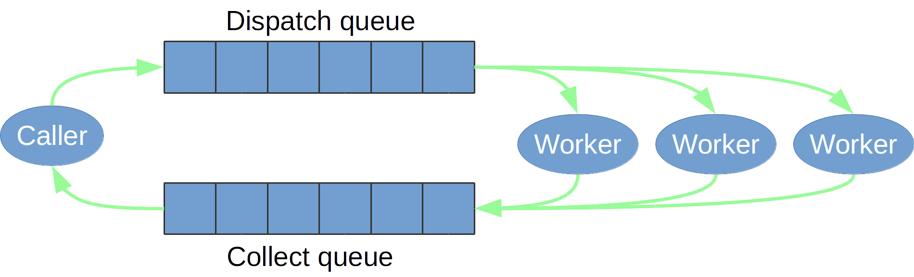
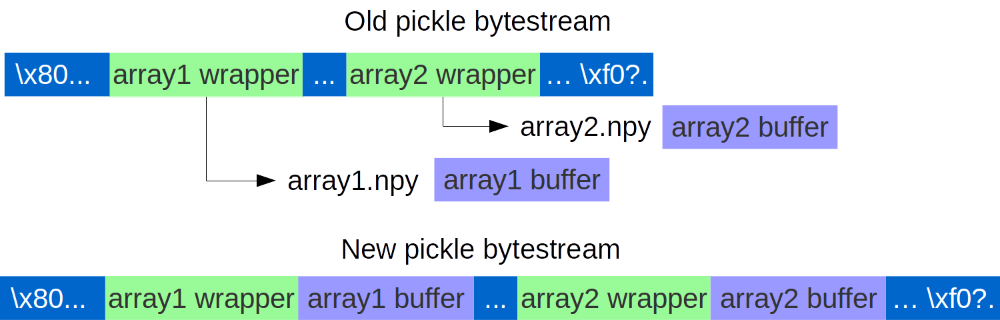
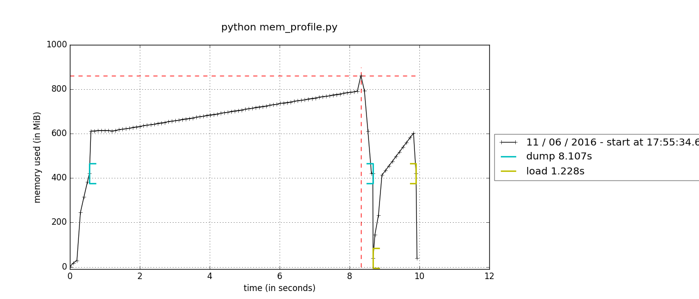
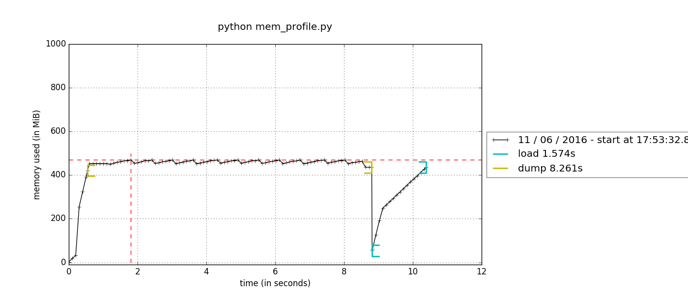
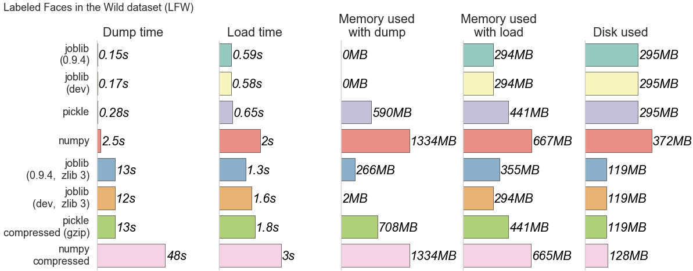

class: center, middle

# **Joblib** <br/>Toward efficient computing<br/>From laptop to cloud

.footnote[
Alexandre Abadie
]


&nbsp;&nbsp;&nbsp;&nbsp;
<br/>


---

class: center, middle

#### Overview of Joblib

#### Recent major improvements

#### What's next

---

## Overview of Joblib


- Embarrassingly Parallel computing helper

--

- Efficient disk caching to avoid recomputation

--

- Fast I/O persistence

--

- No dependencies, optimized for numpy arrays

--

<center></center>
.center[Joblib is the parallel backend used by Scikit-Learn]

.center[[https://pythonhosted.org/joblib/](https://pythonhosted.org/joblib/)]

---

## Parallel helper

<center></center>

--

_Available backends:_ __threading__ and __multiprocessing__ (default)

--

```python
>>> from joblib import Parallel, delayed
>>> from math import sqrt
*>>> Parallel(n_jobs=3, verbose=50)(delayed(sqrt)(i**2) for i in range(6))
[Parallel(n_jobs=3)]: Done   1 tasks      | elapsed:    0.0s
[...]
[Parallel(n_jobs=3)]: Done   6 out of   6 | elapsed:    0.0s finished
[0.0, 1.0, 2.0, 3.0, 4.0, 5.0]
```

---

## Caching on disk

- Use a __memoize__ pattern with the **Memory** object

```python
>>> from joblib import Memory
*>>> mem = Memory(cachedir='/tmp/joblib')
>>> import numpy as np
>>> a = np.vander(np.arange(3)).astype(np.float)
*>>> square = mem.cache(np.square)
>>> b = square(a)
________________________________________________________________________________
[Memory] Calling square...
square(array([[ 0.,  0.,  1.],
       [ 1.,  1.,  1.],
       [ 4.,  2.,  1.]]))
___________________________________________________________square - 0...s, 0.0min

*>>> c = square(a) # no recomputation
```

--

- Use __md5__ hash of input parameters

- Results are persisted on disk

---

## Persistence

- Convert/create __an arbitrary object__ into/from a __string of bytes__

- Persistence in Joblib is based on __pickle__ and __Pickler/Unpickler__ subclasses
```python
>>> import numpy as np
>>> import joblib
>>> obj = [('a', [1, 2, 3]), ('b', np.arange(10))]
*>>> joblib.dump(obj, '/tmp/test.pkl')
['/tmp/test.pkl', '/tmp/test.pkl_01.npy']
*>>> joblib.load('/tmp/test.pkl')
[('a', [1, 2, 3]), ('b', array([0, 1, 2, 3, 4, 5, 6, 7, 8, 9]))]
```

--

- Use compression for fast I/O
```python
*>>> joblib.dump(obj, '/tmp/test.pkl', compress=True, cache_size=0)
['/tmp/test.pkl', '/tmp/test.pkl_01.npy.z']
*>>> joblib.load('/tmp/test.pkl')
```

--

- Access numpy arrays with __`np.memmap`__ for __out-of-core computing__ or for sharing between multiple workers

---

class: middle

##.center[Recent major improvements]

--

 .center[
 #### Persistence
 ]

 .center[
 #### Custom parallel backends
 ]

--

 .center[arriving in version 0.10.0]

---

## Persistence refactoring

* _Until 0.9.4:_

  * An object with __multiple arrays__ is persisted in __multiple files__

  * __Only zlib__ compression available

  * __Memory copies__ with compression

--

* _In 0.10.0:_

  * An object with __multiple arrays__ goes in a __single file__

  * Support of __all compression methods__ provided by the python standard library

  * **No memory copies** with compression

<br/>
<br/>
.center[.bottom[ [https://github.com/joblib/joblib/pull/260](https://github.com/joblib/joblib/pull/260)]]

---

## Persistence refactoring strategy

.center[]

--

- Write numpy array buffer interleaved in the pickle stream
    <dd>__&#x21d2; all arrays in a single file__

<dd><strong>Caveat:</strong> Not compatible with pickle format</dd>

--

- Dump/reconstruct the array by chunks of bytes using numpy functions
    <dd>__&#x21d2; avoid memory copies__

---

## Before: memory copies

.middle[.center[]]

---

## Now: __no__ memory copies

.middle[.center[]]


.footnote[.right[Credits: Memory profiler]]

---

## Persistence in a single file

```python
>>> import numpy as np
>>> import joblib
>>> obj = [np.ones((5000, 5000)), np.random.random((5000, 5000))]

# only 1 file is generated:
*>>> joblib.dump(obj, '/tmp/test.pkl', compress=True)
*['/tmp/test.pkl']
>>> joblib.load('/tmp/test.pkl')
[array([[ 1.,  1., ...,  1.,  1.]],
 array([[ 0.47006195,  0.5436392 , ...,  0.1218267 ,  0.48592789]])]
```

--

- useful with scikit-learn estimators


- simpler management of backup files


- robust when using memory map on distributed file systems

---

## Compression formats

- New supported compression formats<br/>
    <dd>__&#x21d2; gzip, bz2, lzma and xz__

- Automatic compression based on file extension

- Automatic detection of compression format when loading

- Valid compression file formats

- Slower than __zlib__

--

Example with __`gzip`__ compression:

```python
*>>> joblib.dump(obj, '/tmp/test.pkl.gz', compress=('gzip', 3))
>>> joblib.load('/tmp/test.pkl.gz')
[array([[ 1.,  1., ...,  1.,  1.]],
 array([[ 0.47006195,  0.5436392 , ...,  0.1218267 ,  0.48592789]])]
>>> # or with file extension detection
*>>> joblib.dump(obj, '/tmp/test.pkl.gz')
```

---

## Performance comparison: Memory footprint and Speed



--

- Joblib persists __faster__ and with __low extra memory consumption__

--

- Performance is data dependent

.center[[http://gael-varoquaux.info/programming/new_low-overhead_persistence_in_joblib_for_big_data.html](http://gael-varoquaux.info/programming/new_low-overhead_persistence_in_joblib_for_big_data.html)]

---

class: center, middle

## Parallel backends

---

## Custom parallel backends

- _Until 0.9.4:_

  - Only __threading__ and __multiprocessing__ backends

  - Not extensible

  - Active backend cannot be changed easily at a high level

--

- _In 0.10.0:_

  - Common API using **`ParallelBackendBase`** interface

  - Use **`with`** to set the active backend in a context manager

  - New backends for:
      - __distributed__ implemented by Matthieu Rocklin
      - __ipyparallel__ implemented by Min RK
      - __YARN__ implemented by Niels Zielemaker

.center[.bottom[ [https://github.com/joblib/joblib/pull/306](https://github.com/joblib/joblib/pull/306)] contributed by Niels Zielemaker]

---

## Principle

1. Subclass __ParallelBackendBase__:
```python
class ExampleParallelBackend(ParallelBackendBase):
        """Example of minimum parallel backend."""

    def configure(self, n_jobs=1, parallel=None, **backend_args):
        self.n_jobs = self.effective_n_jobs(n_jobs)
        self.parallel = parallel
        return n_jobs

    def apply_async(self, func, callback=None):
        """Schedule a func to be run"""
        result = func() # depends on the backend
        if callback:
            callback(result)
        return result
```
2. Register your backend:
```python
>>> register_parallel_backend("example_backend", ExampleParallelBackend)
```
---

## IPython parallel backend

Integration for Joblib available in version 5.1

--

1. Launch a 5 engines cluster:
```
$ ipcontroller &
$ ipcluster engines -n 5
```
--
2. Run the following script:

```python
import time
import ipyparallel as ipp
from ipyparallel.joblib import register as register_joblib
from joblib import parallel_backend, Parallel, delayed

# Register ipyparallel backend
*register_joblib()
# Start the job
*with parallel_backend("ipyparallel"):
    Parallel(n_jobs=20, verbose=50)(delayed(time.sleep)(1) for i in range(10))
```

---

class: center, middle

### Demo

<br/>

https://github.com/aabadie/ipyparallel-cloud/blob/master/examples/sklearn_parameter_search_local_ipyparallel.ipynb

---

class: center, middle

# What's next

---

## Persistence in file objects

--

1. With regular file object:
```python
*>>> with open('/tmp/test.pkl', 'wb') as fo:
...     joblib.dump(obj, fo)
*>>> with open('/tmp/test.pkl', 'rb') as fo:
...     joblib.load(fo)
```
Also works with __gzip.GzipFile__, __bz2.BZ2File__ and __lzma.LZMAFile__
<br/>
.center[[https://github.com/joblib/joblib/pull/351](https://github.com/joblib/joblib/pull/351)]
<br/>
--

2. Or with any file-like object, e.g exposing read/write functions:
```python
*>>> with RemoteStoreObject(hostname, port, obj_id) as rso:
...     joblib.dump(obj, rso)
*>>> with RemoteStoreObject(hostname, port, obj_id) as rso:
...     joblib.load(rso)
```
<dd>&#x21d2;Example: blob databases, remote storage

---

## Joblib in the cloud

- Share persistence files
.center[&nbsp;&nbsp;&nbsp;&nbsp;

]

- Use computing ressources
.center[
&nbsp;&nbsp;&nbsp;&nbsp;
<br/>
&nbsp;&nbsp;&nbsp;&nbsp;

]

---

## Conclusion

- Persistence of numpy arrays in __a single file__...
<dd> ... and soon in file objects

- New compression formats: __gzip__, __bz2__, __xz__, __lzma__
<dd> ... extend to faster implementations (__blosc__) ?

- Persists __without memory copies__
<dd> ... manipulate bigger data

- New parallel backends: __distributed__, __ipyparallel__, __YARN__...
<dd> ... new ones to come ?
<br/>
.left[#### &nbsp;&nbsp;&nbsp;&nbsp;&nbsp;&nbsp;Thanks ! .right[&nbsp;&nbsp;&nbsp;&nbsp;&nbsp;&nbsp;]
]

---

class: middle, center

### Questions ?

---
