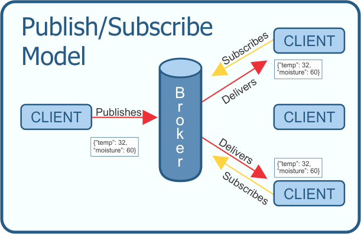
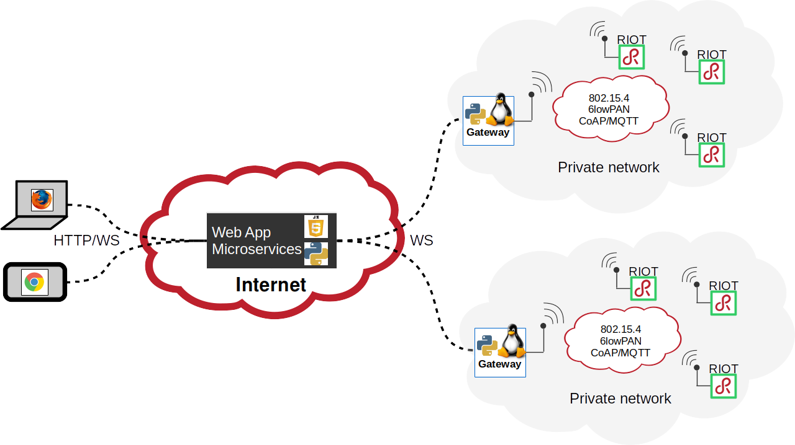
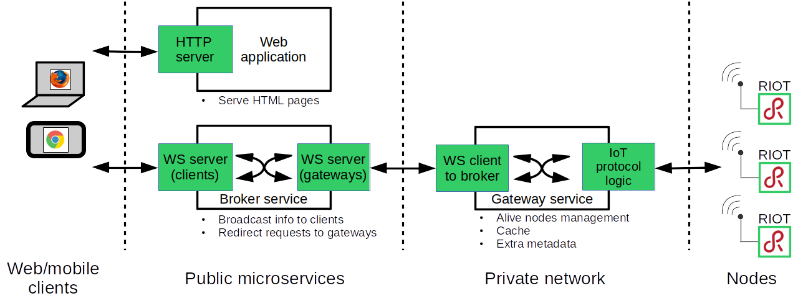
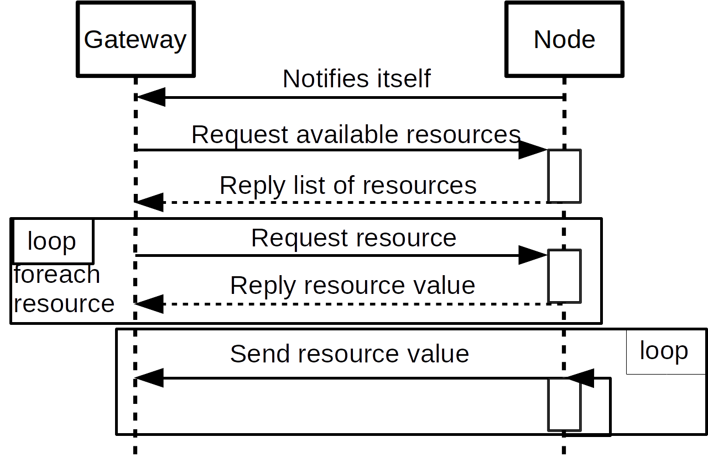

class: center, middle

<br/><br/><br/><br/><br/><br/>

# Python for IoT

## A return of experience

<br/><br/><br/><br/>

.footnote[
Alexandre Abadie, Inria
]

<br/>

---

class: left, middle

## <center>Agenda</center>

### <span style="margin-left:6em">What IoT are we talking about ?</span>

### <span style="margin-left:6em">The usual protocols for IoT</span>

### <span style="margin-left:6em">Why pyaiot?</span>

### <span style="margin-left:6em">How we built Pyaiot</span>

### <span style="margin-left:6em">Lessons learned</span>

### <span style="margin-left:6em">Conclusion</span>

---

## What IoT are we talking about ?

<center>


The Internet of Things today
</center>

---

## High-end devices

<center></center>

---

## Low-end devices

<center></center>

<br/>
.right[&#x21d2; adapted protocols are required]

---

class: left, middle

## <center>Agenda</center>

### <span style="margin-left:6em">What IoT are we talking about ?</span>

### <span style="margin-left:5em;font-weight:bold">&#x21d2; The usual protocols for IoT</span>

### <span style="margin-left:6em">Why Pyaiot?</span>

### <span style="margin-left:6em">How we built Pyaiot</span>

### <span style="margin-left:6em">Lessons learned</span>

### <span style="margin-left:6em">Conclusion</span>

---

## Usual protocols for IoT: CoAP

<br/>
<table style="width:100%">
<tr>
  <td>
  <ul>
      <li> Core WG at IETF specifications (2010)</li>
      <br/>
      <li> <a href=https://tools.ietf.org/html/rfc7252>RFC 7252</a></li>
      <br/>
      <li> Similar to HTTP REST: <br/><br/>GET/PUT/POST/DELETE + OBSERVE<br/></li>
      <br/>
      <li> Works on UDP with small payload overhead</li>
  </ul>
  </td>
  <td>
  
  <div style="position: absolute;right: 100px;">
    <span style="font-style: italic;font-size:12px;text-align:right">
    source: https://fr.wikipedia.org/wiki/CoAP
    </span>
  </div>
  </td>
</tr>
</table>

<br/><br/>

<center>More information at <strong><a href=http://coap.technology>http://coap.technology/</a></strong></center>

---

## CoAP: available implementations in Python

3 available implementations:

* TxThings: Twisted based, Python 2 & 3<br/><br/>
    <span style="margin-left:7em">https://github.com/mwasilak/txThings</span>

<br/>

* Aiocoap: asyncio based, Python 3 only<br/><br/>
    <span style="margin-left:7em">https://github.com/chrysn/aiocoap</span>

<br/>

* CoaPthon: Threading based, Python 2 & 3<br/><br/>
    <span style="margin-left:7em">https://github.com/Tanganelli/CoAPthon</span>

<br/>

Implementations exist for other languages: <strong><a href=http://coap.technology/impls.html>http://coap.technology/impls.html</a></strong>

---

## Usual protocols for IoT: MQTT

<center>
    
    <div style="position: absolute;right: 100px;">
      <span style="font-style: italic;font-size:12px;text-align:right">
      source: https://dev.to/kenwalger/overview-of-the-mqtt-protocol
      </span>
    </div>
</center>

<br/>

* Based on publication/subscriptions to topics pattern

* Topics have a path form: `this/is/a/topic`

* MQTT v3.1.1 is an [OASIS](https://en.wikipedia.org/wiki/OASIS_(organization) standard

* MQTT Sensor Network (MQTT-SN): adapted for constrained devices

---

## MQTT: available implementations in Python

2 available implementations:

* Paho-mqtt: threading based, considered as the reference implementation<br/><br/>
    <span style="margin-left:7em">https://pypi.python.org/pypi/paho-mqtt</span>

<br/>

* HBMQTT: asyncio based<br/><br/>
    <span style="margin-left:7em">https://github.com/beerfactory/hbmqtt</span>

---

class: left, middle

## <center>Agenda</center>

### <span style="margin-left:6em">What IoT are we talking about ?</span>

### <span style="margin-left:6em">The usual protocols for IoT</span>

### <span style="margin-left:5em;font-weight:bold">&#x21d2; Why Pyaiot?</span>

### <span style="margin-left:6em">How we built Pyaiot</span>

### <span style="margin-left:6em">Lessons learned</span>

### <span style="margin-left:6em">Conclusion</span>

---

## Why Pyaiot?

- Need for a web application able to communicate with contrained devices
    <br/><br/><dd>&#x21d2; but constrained devices **cannot use usual web protocols**

--

- Need for multi-site support
    <br/><br/><dd>&#x21d2; but constrained devices **cannot be exposed directly to the web**

--

- Heterogeneous protocol support
    <br/><br/><dd>&#x21d2; **various IoT protocols exist**

--

- No simple and Open Source solution
    <br/><br/><dd>&#x21d2; enforced to use Cloud provider proprietary solutions

---

## How?


- Open-Source and simple design&#x21d2; <strong>can be deployed by anyone</strong>

--

- Multiprotocol: CoAP, MQTT, etc &#x21d2; <strong>interoperability</strong>

--

- Modular &#x21d2; <strong>extensible</strong>

--

- Bi-directionnal and real time access to nodes &#x21d2; <strong>reactive</strong>

--

- No constraint regarding the backend language &#x21d2; <strong>let's choose Python!</strong>

--

- Pyaiot targets contrained nodes running RIOT: <strong><a href=https://riot-os.org>https://riot-os.org</a></strong>

<center></center>

---

class: left, middle

## <center>Agenda</center>

### <span style="margin-left:6em">What IoT are we talking about ?</span>

### <span style="margin-left:6em">The usual protocols for IoT</span>

### <span style="margin-left:6em">Why Pyaiot?</span>

### <span style="margin-left:5em;font-weight:bold">&#x21d2; How we built Pyaiot</span>

### <span style="margin-left:6em">Lessons learned</span>

### <span style="margin-left:6em">Conclusion</span>

---

## Pyaiot: overview



<div style="text-align:center"><span style="font-style:bold">
<span style="width:100%;font-style:bold">
<strong><a href=https://github.com/pyaiot/pyaiot>https://github.com/pyaiot/pyaiot</a></strong>
</span>
<br/><br/>
Permanent web showcase for RIOT available at <br/><a href=http://riot-demo.inria.fr>http://riot-demo.inria.fr</a></span>
</div>


---

## Pyaiot services

<span style="margin-left:-1.5em"></span>

- Gateways are clients running in private networks

- Nodes are kept isolated from Internet

- Messages exchanged in JSON format

- Works with low-end devices (RIOT) and high-end devices (Python)

---

## Technical choices

<div style="position:absolute;margin-left:30em;margin-top:-1em"><a href=http://vuejs.org></a></div>
* Web dashboard developped with **Vue.js** &nbsp; http://vuejs.org

<div style="position:absolute;margin-left:30em;margin-top:-0.7em"><a href=http://www.tornadoweb.org/en/stable/></a></div>
* Service applications based on **Tornado** framework with:
    * HTTP server
    * Websocket server and client

* **Aiocoap** for CoAP protocol support

* **HBMQTT** for MQTT protocol support

All python packages are asyncio based/compatible &#x21d2; **simplify integration**


<center></center>

---

## Resource discovery

<center>How to discover the resources exposed by a node ?</center>

Dependent from the protocol:

- CoAP: `.well-known/core` endpoint
```
    </.well-known/core>;ct=40,</board>;ct=0,</mcu>;ct=0,</led>;ct=0
```

--

- MQTT: a developer design choice

--

<center>
<br/>
<span style="width:100%;font-size:15px;font-style:bold">Resource discovery sequence</span>

</center>

---

## The CoAP gateway in detail

- Nodes declares themselves to the gateway at startup

- The gateway runs a CoAP server to receive notifications from nodes

- Each node also runs a CoAP server

<br/>
<br/>

--

<center></center>

---

## The MQTT gateway in detail

- MQTT-SN is required for low-end device <br/>
    <dd>&#x21d2; a MQTT to MQTT-SN gateway/broker is required

- No implementation in Python <br/>
    <dd>&#x21d2; let's go for <a href=https://github.com/eclipse/mosquitto.rsmb>mosquitto.rsmb</a>

<br/>

--

<center></center>

<br/>

<center>
<span style="font-size:18px;font-weight:bold ">Node/Gateway</span>
<table style="width:600px">
<tr>
<td>
      <center><span style="font-size:18px">subscribe/publish to topic</span></center>
</td>
<td>
      <center><span style="text-align:left;font-size:18px">publish/subscribe to topics</span></center>
</td>
</tr>
<tr>
  <td>
  <ul>
      <li><span style="font-style:italic;font-size:15px">gateway/&lt;node id&gt;/discover</span></li>
      <br/>
      <br/>
  </ul>
  </td>
  <td>
  <ul>
    <li><span style="font-size:15px;font-style:italic">node/check</span></li>
    <li><span style="font-size:15px;font-style:italic">node/&lt;node id&gt;/resources</span></li>
    <li><span style="font-size:15px;font-style:italic">node/&lt;node id&gt;/&lt;resource&gt;</span></li>
  </ul>
  </td>
</tr>
</table>
</center>

---

## Future work

- Add services for data persistence: time series, data analysis

--

- Provide services in containers

--

- Better integration:

    -  with other high-level IoT solutions: <br/>
    <dd>Node-RED, OneM2M, FIWARE, SensorCloud, ThingSpeak

    - with gateways from IoT providers: <br/>
    <dd>SigFox, Actility ThingPark, LoRa gateways

    - with Cloud providers:
    <dd>Amazon AWS, Google Cloud, etc

--

- Better testing/documentation

---

class: left, middle

## <center>Agenda</center>

### <span style="margin-left:6em">What IoT are we talking about ?</span>

### <span style="margin-left:6em">The usual protocols for IoT</span>

### <span style="margin-left:6em">Why pyaiot?</span>

### <span style="margin-left:6em">How we built Pyaiot</span>

### <span style="margin-left:5em;font-weight:bold">&#x21d2; Lessons learned</span>

### <span style="margin-left:6em">Conclusion</span>

---

## Using asyncio

- Easy to read asynchronous programming language

--

- Asyncio new syntax available with Python >= 3.5

--

  <dd> ... but Python 3.4.2 available on Raspbian

```python
@asyncio.coroutine
def my_coroutine():
    my_long_call()

yield from my_coroutine()  # wait until done
asyncio.get_event_loop().create_task(my_coroutine)  # scheduled in ioloop
asyncio.ensure_future(my_coroutine)  # scheduled in ioloop, requires python 3.4.4
```

--

with python 3.5 new syntax:

```python
async def my_coroutine():
    my_long_call()

await my_coroutine()  # wait until done
asyncio.ensure_future(my_coroutine) # scheduled in ioloop
```

---

## Using asyncio

- Easy to integrate with Tornado

    - What about <a href=http://aiohttp.readthedocs.io/en/stable/>aiohttp</a> ?
    - Others ?

--

- How to test asynchronous code ?<br/>

    - <a href=https://github.com/eugeniy/pytest-asyncio>pytest-asyncio</a>,
    - <a href=https://github.com/eugeniy/pytest-tornado>pytest-tornado</a>,
    - <a href=https://github.com/tylerlaberge/Jasper>Jasper</a>

--

- Asyncio is part of the Python standard library: the future !

---

class: center, middle

## New python project &#x21d2; Python 3 only

---

## The benefits of Python

- Develop fast, even with complex things

--

- Can run on any high-end device : from a Raspberry PI to a Cloud server

--

- Off-the-shelf packages for IoT available

--

<br/><br/>

.center[**&#x21d2; Python is adapted to IoT**]

---

class: middle

## <center>Conclusion</center>

- Widely used protocol in IoT is MQTT

- We need adapted protocols required for constrained devices: CoAP, MQTT-SN

- We easily built an application following the initial requirements: Pyaiot

- Asyncio made things simpler... after some headaches

---

class: center, middle

## Demo!

<strong><a href=http://riot-demo.inria.fr>http://riot-demo.inria.fr</a></strong>


---

class: center, middle

## Thanks!
