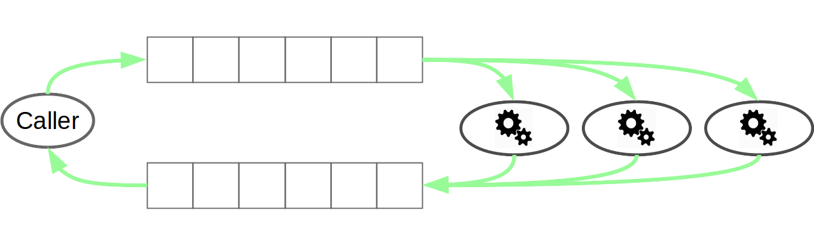

class: center, middle

<br/><br/><br/><br/><br/><br/>

## Cloud computing made easy

### with 

# Joblib

<br/><br/>

.footnote[
Alexandre Abadie
]

<br/>

---

class: left, middle

## <center>Agenda</center>

### <span style="margin-left:7em">Joblib in a word</span>

### <span style="margin-left:7em">Joblib for cloud computing</span> 

### <span style="margin-left:7em">Future work</span>

---

## Joblib in a word

<br/>
<br/>

<center><span style="font-size:25px;font-weight:bold">A Python package that runs functions in parallel?</span></center>

<br/>
<br/>

--

<center><span style="font-size:25px;font-style:italic">not only...</span></center>


--

<br/>
<br/>

<center><span style="font-size:25px;font-weight:bold"><a style="color:orange    " href=https://pythonhosted.org/joblib/>https://pythonhosted.org/joblib/</a></span></center>

---

## Why Joblib?

- Need for algorithms to run fast

    <dd>&#x21d2; <span style="font-weight:bold">Optimize available computing resources</span>

<br/>

--

- Need to work on large datasets

    <dd>&#x21d2; <span style="font-weight:bold">Work on data that fits in RAM</span>

<br/>

--

- Keep internal algorithm logic unchanged

    <dd>&#x21d2; <span style="font-weight:bold">Adapted to embarrassingly parallel problems</span>

<br/>

--

- Need for simple API

    <dd>&#x21d2; <span style="font-weight:bold">But parallel programming is not user friendly in general</span>

<br/>

---

## What's provided by Joblib then?


- Embarrassingly Parallel computing helper

    <dd>&#x21d2; <span style="font-weight:bold">make parallel computing easy</span>

--

<br/>

- Efficient disk caching to avoid recomputation

    <dd>&#x21d2; <span style="font-weight:bold">computation resource friendly</span>

--

<br/>

- Fast I/O persistence

    <dd>&#x21d2; <span style="font-weight:bold">limit cache access time</span>

--

<br/>

- No dependencies, optimized for numpy arrays

    <dd>&#x21d2; <span style="font-weight:bold">simple installation and integration in other projects</span>

---

## Parallel helper

<center></center>

--

- _Internal available backends:_ __threading__ and __multiprocessing__

    <dd>&#x21d2; Single machine computing (works on a Laptop)

--

```python
>>> from joblib import Parallel, delayed
>>> from math import sqrt
*>>> Parallel(n_jobs=3, verbose=50)(delayed(sqrt)(i**2) for i in range(6))
[Parallel(n_jobs=3)]: Done   1 tasks      | elapsed:    0.0s
[...]
[Parallel(n_jobs=3)]: Done   6 out of   6 | elapsed:    0.0s finished
[0.0, 1.0, 2.0, 3.0, 4.0, 5.0]
```

--

- API can be extended with external backends:

    <dd>&#x21d2; Parallel backends available for **distributed**, **ipyparallel**

---

## Caching on disk

- Use a __memoize__ pattern with the **Memory** object

```python
>>> from joblib import Memory
*>>> mem = Memory(cachedir='/tmp/joblib')
>>> import numpy as np
>>> a = np.vander(np.arange(3)).astype(np.float)
*>>> square = mem.cache(np.square)
>>> b = square(a)
________________________________________________________________________________
[Memory] Calling square...
square(array([[ 0.,  0.,  1.],
       [ 1.,  1.,  1.],
       [ 4.,  2.,  1.]]))
___________________________________________________________square - 0...s, 0.0min

*>>> c = square(a) # no recomputation
```

--

- Use __md5__ hash of input parameters

- Results are persisted on disk for later reuse

- **Least Recently Used** (LRU) cache replacement policy

---

## Persistence

- Convert/create __an arbitrary object__ into/from a __string of bytes__

- **Single file persistence**, can be used with file objects
```python
>>> import numpy as np
>>> import joblib
>>> obj = [('a', [1, 2, 3]), ('b', np.arange(10))]
*>>> joblib.dump(obj, '/tmp/test.pkl')
['/tmp/test.pkl']
*>>> with open('/tmp/test.pkl', 'rb') as f:
*>>>     joblib.load(f)
[('a', [1, 2, 3]), ('b', array([0, 1, 2, 3, 4, 5, 6, 7, 8, 9]))]
```

--

- Use compression for fast I/O:<br/>
    &nbsp;&nbsp;&nbsp;support for **zlib, gz, bz2, xz and lzma** compressors 
```python
*>>> joblib.dump(obj, '/tmp/test.pkl.gz', compress=True, cache_size=0)
['/tmp/test.pkl.gz']
*>>> joblib.load('/tmp/test.pkl.gz')
```

--

- Access numpy arrays with __`np.memmap`__ for __out-of-core computing__ or 
for sharing data between multiple workers

---

## The ecosystem

- 54 differents contributors since the beginning in 2008
<br/><br/>
<span style="margin-left:22em"></span>
<br/>

--

- Joblib is the parallel/caching backend used in Scikit-Learn
<br/><br/>
<span style="margin-left:22em"></span>

--

- Installed on 1.5% of the computers running Debian
<br/>

--
<br/>
- Stable and mature code base
<br/>

<center>
    <span style="font-size:25px;font-weight:bold">
        <a style="color:orange" href=https://github.com/joblib/joblib>
            https://github.com/joblib/joblib
        </a>
    </span>
</center>

---

class: left, middle

## <center>Agenda</center>

### <span style="margin-left:7em">Joblib in a word</span>

### <span style="margin-left:6em;font-weight:bold">&#x21d2;Joblib for cloud computing</span> 

### <span style="margin-left:7em">Future work</span>

---

## The Cloud trend

- Lots of Cloud providers on the market:

&nbsp;&nbsp;
&nbsp;&nbsp;
&nbsp;&nbsp;
&nbsp;&nbsp;


--

- Lots of Big Data processing solutions:

<span style="margin-left:20em">&nbsp;&nbsp;&nbsp;&nbsp;
</span>

--

- Lots of technologies:  Docker containers, orchestrators (SWARM, Kubernetes)

<span style="margin-left:20em">&nbsp;&nbsp;&nbsp;&nbsp;
</span>

--
<br/>

<center><span style="font-size:25px;font-weight:bold">How can Joblib be used there?</span></center>

---

## Extend parallel backend

**Principle:** configure your backend and wrap the calls to Parallel

```python
import time
import ipyparallel as ipp
from ipyparallel.joblib import register as register_joblib
from joblib import parallel_backend, Parallel, delayed

# Setup ipyparallel backend
register_joblib()
dview = ipp.Client()[:]
# Start the job
with parallel_backend("ipyparallel", view=dview):
    Parallel(n_jobs=20, verbose=50)(delayed(time.sleep)(1) for i in range(10))
```

--

Other examples exist for:

<ul>
<li> Dask distributed: <a style="color:orange" href=https://github.com/ogrisel/docker-distributed>https://github.com/ogrisel/docker-distributed</a></li>
<br/>
<li>Hadoop YARN: <a style="color:orange" href=https://github.com/joblib/joblib-hadoop>https://github.com/joblib/joblib-hadoop</a></li>
</ul>

---

## Extend caching with store backends

<ul>
    <li>Extends Memory API with other store providers</li>
    <br/>
    <li>Not available upstream yet:
    <br/>
    &#x21d2; PR opened at <a style="color:orange" href=https://github.com/joblib/joblib/pull/397>https://github.com/joblib/joblib/pull/397</a>
    </li>
</ul>

```python
import numpy as np
from joblib import Memory
from joblibhadoop.hdfs import register_hdfs_store_backend

# Register HDFS store backend provider
register_hdfs_store_backend()
# Persist data in hdfs://namenode:9000/user/john/cache/joblib
*mem = Memory(location='cache', backend='hdfs',
*             host='namenode', port=9000, user='john', compress=True)
mem.clear()
multiply = mem.cache(np.multiply)
```

--

Store backends available:

<ul>
<li>Amazon S3: <a style="color:orange" href=https://github.com/aabadie/joblib-s3>https://github.com/aabadie/joblib-s3</a></li>
<br/>
<li>Hadoop HDFS: <a style="color:orange" href=https://github.com/joblib/joblib-hadoop>https://github.com/joblib/joblib-hadoop</a>
</li>
</ul>

---

## Future work

- In-memory object caching

    &#x21d2; Should save RAM during a parallel job

<br/>

--

- Allow overriding of parallel backends

    &#x21d2; See PR: https://github.com/joblib/joblib/pull/524

<br/>

--

- Replace multiprocessing parallel backend with Loky:

    &#x21d2; See PR: https://github.com/joblib/joblib/pull/516

<br/>

--

- Extend support for Cloud providers

    &#x21d2; Using Apache libcloud: give access to a lot more Cloud providers

---

class: center, middle

## Thanks!
