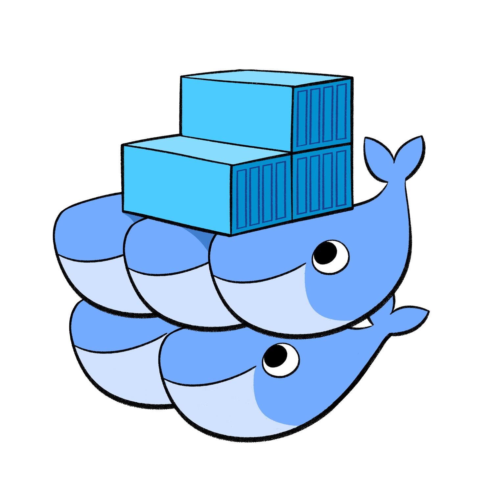

class: center, middle

<br/><br/><br/><br/><br/><br/>

## Cloud computing made easy

### in 

# Joblib

<br/><br/>

.footnote[
Alexandre Abadie
]

<br/>

---

class: left, middle

## <center>Outline</center>

### <span style="margin-left:7em">An overview of Joblib</span>

### <span style="margin-left:7em">Joblib for cloud computing</span> 

### <span style="margin-left:7em">Future work</span>

---

## Joblib in a word

<br/>
<br/>
<br/>
<br/>
<br/>
<br/>

<center><span style="font-size:25px;font-weight:bold">
A Python package to make your algorithms run faster</span></center>

<br/>
<br/>

--

<br/>
<br/>

<center><span style="font-size:25px;font-weight:bold"><a style="color:orange    " href=http://joblib.readthedocs.io>http://joblib.readthedocs.io</a></span></center>

---

## The ecosystem

- <span style="color:orange">**54 different contributors**</span> since the beginning in 2008

<center>
  <br/>
  <span style="font-style: italic;font-size:18px;text-align:center">
    Contributors per month
  </span>
</center>

--

- Joblib is the computing backend <span style="color:orange">**used by Scikit-Learn**</span>
<br/><br/>
<center></center>

--
<br/>
- <span style="color:orange">**Stable and mature**</span> code base
<br/>

<center>
    <span style="font-size:25px;font-weight:bold">
        <a style="color:orange" href=https://github.com/joblib/joblib>
            https://github.com/joblib/joblib
        </a>
    </span>
</center>

---


## Why Joblib?

--

- Because we want to <span style="color:orange">**make use of all available computing resources**</span>

--

    <dd>&#x21d2; <span style="font-weight:bold">And ensure algorithms run as fast as possible</span>

<br/>

--

- Because we work on <span style="color:orange">**large datasets**</span>

--

    <dd>&#x21d2; <span style="font-weight:bold">Data that just fits in RAM</span>

<br/>

--

- Because we want the <span style="color:orange">**internal algorithm logic**</span> to remain <span style="color:orange">**unchanged**</span>

--

    <dd>&#x21d2; <span style="font-weight:bold">Adapted to embarrassingly parallel problems</span>

<br/>

--

- Because we love <span style="color:orange">**simple APIs**</span>

--

    <dd>&#x21d2; <span style="font-weight:bold">And parallel programming is not user friendly in general</span>

<br/>

---

## How?


- <span style="color:orange">Embarrassingly Parallel computing helper</span>

    <dd>&#x21d2; <span style="font-weight:bold">make parallel computing easy</span>

--

<br/>

- <span style="color:orange">Efficient disk caching to avoid recomputation</span>

    <dd>&#x21d2; <span style="font-weight:bold">computation resource friendly</span>

--

<br/>

- <span style="color:orange">Fast I/O persistence</span>

    <dd>&#x21d2; <span style="font-weight:bold">limit cache access time</span>

--

<br/>

- <span style="color:orange">No dependencies</span  >, optimized for numpy arrays

    <dd>&#x21d2; <span style="font-weight:bold">simple installation and integration in other projects</span>

---

## Overview


<br/><br/>
<br/><br/>
<center></center>

---

## Parallel helper

```python
>>> from joblib import Parallel, delayed
>>> from math import sqrt

*>>> Parallel(n_jobs=3, verbose=50)(delayed(sqrt)(i**2) for i in range(6))
[Parallel(n_jobs=3)]: Done   1 tasks      | elapsed:    0.0s
[...]
[Parallel(n_jobs=3)]: Done   6 out of   6 | elapsed:    0.0s finished
[0.0, 1.0, 2.0, 3.0, 4.0, 5.0]
```

<center></center>

--

<br/>

&#x21d2; **API can be extended with external backends**


---

## Parallel backends

- <span style="color:orange">Single machine backends</span>:  works on a Laptop

    &#x21d2; **threading**, **multiprocessing** and soon **Loky**

--

- <span style="color:orange">Multi machine backends</span>: available as optional extensions

    &#x21d2; **distributed**, **ipyparallel**, **CMFActivity**, **Hadoop Yarn**

--

```python
>>> from distributed.joblib import DistributedBackend
>>> from joblib import (Parallel, delayed,
>>>                      register_parallel_backend, parallel_backend)

*>>> register_parallel_backend('distributed', DistributedBackend)
*>>> with parallel_backend('distributed', scheduler_host='dscheduler:8786'):
*>>>     Parallel(n_jobs=3)(delayed(sqrt)(i**2) for i in range(6))
[...]
```

--

- Future: new backends for **Celery**, **Spark**

---

## Caching on disk

- Use a <span style="color:orange">__memoize__</span> pattern with the **Memory** object

```python
>>> from joblib import Memory
>>> import numpy as np
>>> a = np.vander(np.arange(3)).astype(np.float)

*>>> mem = Memory(cachedir='/tmp/joblib')
*>>> square = mem.cache(np.square)
```

--

```
>>> b = square(a)
________________________________________________________________________________
[Memory] Calling square...
square(array([[ 0.,  0.,  1.],
       [ 1.,  1.,  1.],
       [ 4.,  2.,  1.]]))
___________________________________________________________square - 0...s, 0.0min

>>> c = square(a) # no recomputation
array([[ 0.,  0.,  1.],
[...]
```

--

- <span style="color:orange">**Least Recently Used (LRU)**</span> cache replacement policy

---

## Persistence

- Convert/create __an arbitrary object__ into/from a __string of bytes__

- <span style="color:orange">**Streamable persistence**</span> to/from file or socket objects
```python
>>> import numpy as np
>>> import joblib
*>>> obj = [('a', [1, 2, 3]), ('b', np.arange(10))]
*>>> joblib.dump(obj, '/tmp/test.pkl')
['/tmp/test.pkl']
*>>> with open('/tmp/test.pkl', 'rb') as f:
*>>>     joblib.load(f)
[('a', [1, 2, 3]), ('b', array([0, 1, 2, 3, 4, 5, 6, 7, 8, 9]))]
```

--

- Use <span style="color:orange">**compression for fast I/O**</span>:<br/>
    &nbsp;&nbsp;&nbsp;support for **zlib, gz, bz2, xz and lzma** compressors 
```python
*>>> joblib.dump(obj, '/tmp/test.pkl.gz', compress=True, cache_size=0)
['/tmp/test.pkl.gz']
>>> joblib.load('/tmp/test.pkl.gz')
```

---

class: left, middle

## <center>Outline</center>

### <span style="margin-left:7em">Joblib in a word</span>

### <span style="margin-left:6em;font-weight:bold">&#x21d2;Joblib for cloud computing</span> 

### <span style="margin-left:7em">Future work</span>

---

## The Cloud trend

- Lots of Cloud providers on the market:

&nbsp;&nbsp;
&nbsp;&nbsp;
&nbsp;&nbsp;
&nbsp;&nbsp;
&nbsp;&nbsp;


--

- Existing solutions for processing Big Data:

<span style="margin-left:20em">
&nbsp;&nbsp;&nbsp;&nbsp;
&nbsp;&nbsp;&nbsp;&nbsp;

</span>

--

- Existing container orchestration solutions: Docker SWARM, Kubernetes

<span style="margin-left:20em">&nbsp;&nbsp;&nbsp;&nbsp;
</span>

--
<br/>

<center><span style="font-size:25px;font-weight:bold">How can Joblib be used with them?</span></center>

---

## The general idea

<center></center>

---

## Use pluggable multi-machine parallel backends

**Principle:** configure your backend and wrap the calls to Parallel

```python
>>> import time
>>> import ipyparallel as ipp
>>> from ipyparallel.joblib import register as register_joblib
>>> from joblib import parallel_backend, Parallel, delayed

# Setup ipyparallel backend
>>> register_joblib()
>>> dview = ipp.Client()[:]

# Start the job
*>>> with parallel_backend("ipyparallel", view=dview):
*>>>     Parallel(n_jobs=20, verbose=50)(delayed(time.sleep)(1) for i in range(10))
```

--

Complete examples exist for:

<ul>
<li> Dask distributed: <a style="color:orange" href=https://github.com/ogrisel/docker-distributed>https://github.com/ogrisel/docker-distributed</a></li>
<br/>
<li>Hadoop Yarn: <a style="color:orange" href=https://github.com/joblib/joblib-hadoop>https://github.com/joblib/joblib-hadoop</a></li>
</ul>

---

## Use pluggable store backends

<ul>
    <li>Extends Memory API with other store providers</li>
    <br/>
    <li>Not available upstream yet:
    <br/>
    &#x21d2; PR opened at <a style="color:orange" href=https://github.com/joblib/joblib/pull/397>https://github.com/joblib/joblib/pull/397</a>
    </li>
</ul>

--

```python
>>> import numpy as np
>>> from joblib import Memory
>>> from joblibhadoop.hdfs import register_hdfs_store_backend

# Register HDFS store backend provider
*>>> register_hdfs_store_backend()
# Persist data in hdfs://namenode:9000/user/john/cache/joblib
*>>> mem = Memory(location='cache', backend='hdfs',
*>>>              host='namenode', port=9000, user='john', compress=True)
multiply = mem.cache(np.multiply)
```

--

Store backends available:

<ul>
<li>Amazon S3: <a style="color:orange" href=https://github.com/aabadie/joblib-s3>https://github.com/aabadie/joblib-s3</a></li>
<br/>
<li>Hadoop HDFS: <a style="color:orange" href=https://github.com/joblib/joblib-hadoop>https://github.com/joblib/joblib-hadoop</a>
</li>
</ul>

---

## Using Hadoop with Joblib

<ul>
<li>joblib-hadoop package: <a style="color:orange" href=https://github.com/joblib/joblib-hadoop>https://github.com/joblib/joblib-hadoop</a></li>
</ul>

--

- Provides **docker containers helpers** for developing and testing

<br/>
<span style="margin-left:2em;margin-top:0.5em"></span>

--

<div style="margin-left:2em;margin-top:2em">
    <span style="position:absolute;margin-top:0.5em">&#x21d2; no need for a production Hadoop cluster</span><br/>
    <span style="position:absolute;margin-top:1.5em">&#x21d2; make developer life easier: <span style="font-weight:bold">CI on Travis is 
    possible</span></span><br/>
    <span style="position:absolute;margin-top:2.5em">&#x21d2; local repository on host is shared with Joblib-hadoop-node container</span><br/>
</div>

--

<div style="position:absolute;margin-left:30em;margin-top:-5.5em"></div>

---

class: left, middle

## <center>Outline</center>

### <span style="margin-left:7em">Joblib in a word</span>

### <span style="margin-left:7em">Joblib for cloud computing</span> 

### <span style="margin-left:6em;font-weight:bold">&#x21d2;Future work and conclusion</span>

---

## Future work

- In-memory object caching

    &#x21d2; Should save RAM during a parallel job

<br/>

--

<ul>
    <li>Allow <span style="font-style:italic">overriding</span> of parallel backends</li>
    <br/>
    &#x21d2; See PR: <a style="color:orange;font-weight:bold" href=https://github.com/joblib/joblib/pull/524>https://github.com/joblib/joblib/pull/524</a>
    <br/><br/>
    &#x21d2; Seamless distributed computing in scikit-learn
    </li>
</ul>

<br/>

--

<ul>
    <li>Replace multiprocessing parallel backend with <span style='font-weight:bold'>Loky</span></li>
    <br/>
    &#x21d2; See PR: <a style="color:orange;font-weight:bold" href=https://github.com/joblib/joblib/pull/516>https://github.com/joblib/joblib/pull/516</a>
    </li>
</ul>

<br/>

--

- Extend Cloud providers support

    &#x21d2; Using **Apache libcloud**: give access to a lot more Cloud providers

---

## Conclusion

--

- Parallel helper is <span style="color:orange">**adapted to embarassingly parallel problems**</span>

<br/>

--

- Already a lot of <span style="color:orange">**parallel backends available**</span>

    &#x21d2; threading, multiprocessing, loky, CMFActivity distributed, ipyparallel, Yarn

<br/>

--

- Use <span style="color:orange">**caching techniques**</span> to avoid recomputation

<br/>

--

- Extra <span style="color:orange">**Store backends**</span> available  &#x21d2; **HDFS (Hadoop)** and **AWS S3**

<br/>

--

- Use Joblib either **on your laptop** or **in a Cloud** with <span style="color:orange">**very few code changes**</span>

---

class: center

<br/>
<br/>
<br/>
<br/>
<br/>
<br/>
<br/>
<br/>
<br/>

## Thanks!

<br/>
<br/>

<a href="https://sed.saclay.inria.fr/"></a>&nbsp;&nbsp;&nbsp;
<a href="https://github.com/lesteve"></a>&nbsp;&nbsp;&nbsp;<a href="https://github.com/GaelVaroquaux"></a>&nbsp;&nbsp;&nbsp;
<a href="https://github.com/ogrisel"></a>
<br/><br/>
<a href="http://www.scikit-learn.org"></a>&nbsp;&nbsp;&nbsp;
<a href="http://www.criteo.com"></a>&nbsp;&nbsp;&nbsp;
&nbsp;&nbsp;&nbsp;
<a href="http://www.inria.fr"></a>
